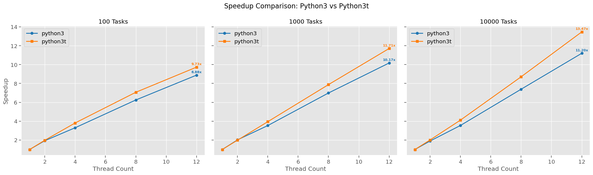
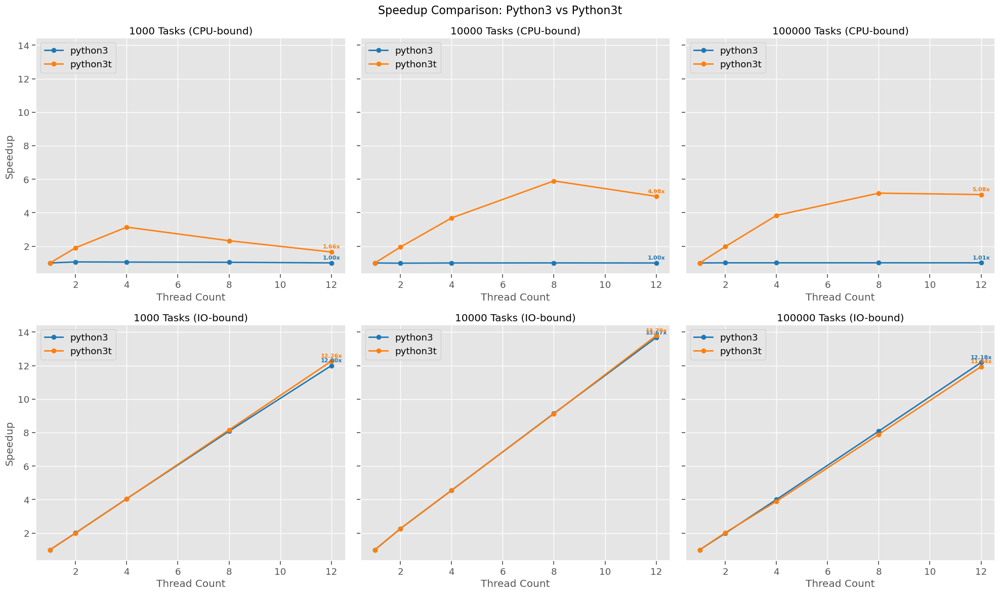
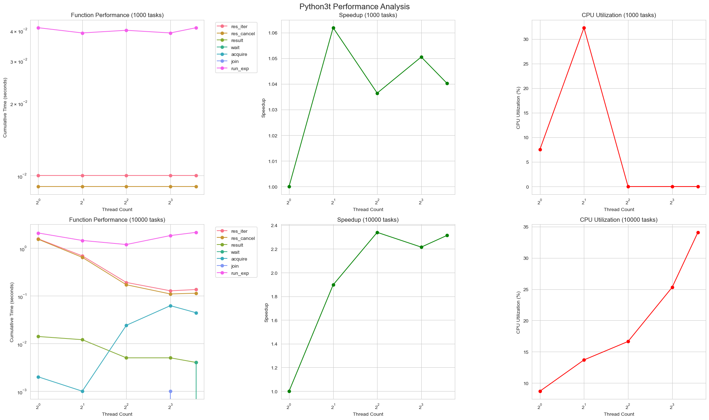
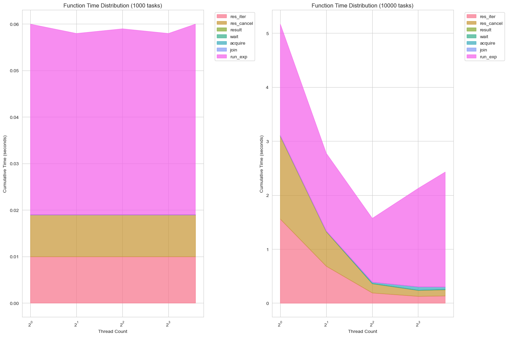

# RCA: bench_thread_pool

```python

from concurrent.futures import ThreadPoolExecutor

with ThreadPoolExecutor(max_workers=num_threads) as executor:
       if task_type == "cpu":
           list(executor.map(cpu_bound_task, range(num_tasks)))
       else:
           list(executor.map(io_bound_task, range(num_tasks)))
```


### Platform setup:
python interpreter versions used for comparison-
- Python Version: 3.13.0 (v3.13.0:60403a5409f, Oct  7 2024, 00:37:40) [Clang 15.0.0 (clang-1500.3.9.4)]
- Python Version: 3.13.0 experimental free-threading build (v3.13.0:60403a5409f, Oct  7 2024, 00:49:37) [Clang 15.0.0 (clang-1500.3.9.4)]
----
- OS: posix - darwin
- CPU Count: 12
- Total Memory: 36.00 GB
----

### Experiment1: 
study scaling of threads for n tasks 

#### Result:


#### Observation:
1. python3t (free-threading build) consistently outperforms standard python3(GIL) across all task sizes (100, 1000, 10000).
2. performance gap between python3t and python3(GIL) widens as the number of tasks increases.
3. both show improved speedup as the thread count increases, but python3t scales better.
4. The maximum speedup for python3t reaches about 13.47x with 12 threads for 10000 tasks, while python3(GIL)(GIL) reaches about 11.20x.

----

### Experiment2: 
study scaling of threads for n tasks with breakdown - cpu-bound vs io-bound tasks
I.e. to study thread scaling for cpu-bound and io-bound 

#### Result:


#### Observation:
1. CPU-bound tasks:
   - The speedup for python3t increases with the number of tasks and threads, reaching up to 5.08x for 100000 tasks with 12 threads.
   - python3(GIL) shows minimal speedup (around 1.0x) regardless of thread count or task number, indicating GIL limitations.

2. IO-bound tasks:
   - speedup increases linearly with thread count for both versions, reaching about 12x for both.
   - no significant difference between python3(GIL) and python3t for IO-bound tasks, suggesting that the GIL doesn't heavily impact IO operations.

3. Task count impact:
   - For CPU-bound tasks, increasing the task count from 1000 to 100000 improves the relative performance of python3t over python3(GIL).
   - There is a plateauing effect on the performance gain around 8 threads (for the current platform setup). Might be interesting to get similar data from other platforms and create generalizable equation.

### Experiment3: 
Study cpu-bound workload breakdown further with call-stack and track how important functions scale with thread count and task count. 

#### Result:




#### Observation:
- function time distribution:
   - For 1000 tasks, the distribution remains fairly constant across thread counts, core task execution dominating.
   - For 10000 tasks, as thread count increases:
     - The proportion of time in `res_iter` and `res_or_cancel` decreases, indicating more efficient result handling.
     - Time spent in `acquire` increases, reflecting growing lock contention.
     - `run_exp` proportion grows, possibly due to increased thread management overhead.

- speedup:
   - For 1000 tasks, speedup is minimal (max ~1.06x), indicating that the overhead of thread management outweighs benefits for small task counts.
   - With 10000 tasks, speedup is more pronounced, reaching ~2.3x at 4 threads, showing better utilization of parallelism for larger workloads.
   - Speedup plateaus after 4 threads for 10000 tasks, suggesting a limit to parallelism benefits, possibly due to increased contention or task distribution overhead. (to be investigated further)

- cpu util:
   - For 1000 tasks, cpu-util peaks at 2 threads (~32%) then drops, indicating potential over-threading for small workloads.
   - With 10000 tasks, cpu-util increases steadily with thread count, reaching ~35% at 12 threads, showing better core utilization for larger workloads.

- scalability insights:
   - The free-threading build shows better scalability for larger task counts (10000) compared to smaller ones (1000).
   - There's a clear trade-off point where the benefits of parallelism outweigh the overhead of thread management, occurring between 1000 and 10000 tasks for this system.
   - Lock contention (indicated by `acquire` time) becomes a more significant factor as both task count and thread count increase.
